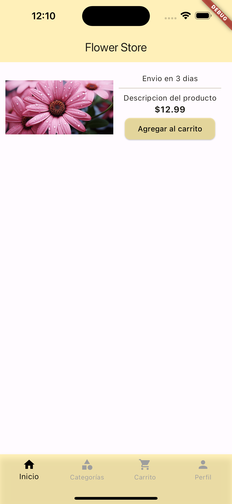
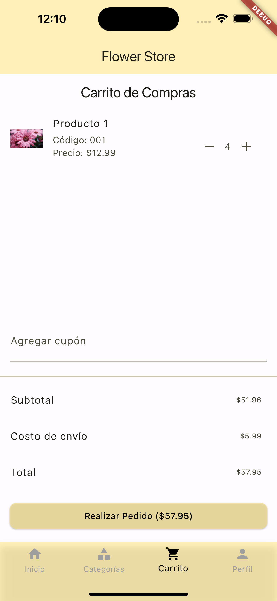

# Tienda en Línea de Florería 🌸

Una aplicación de Flutter para una tienda en línea de una florería, que presenta un catálogo de flores y plantas, permitiendo a los usuarios navegar por el catálogo y agregar productos a un carrito de compras.

## 📸 Captura de Pantalla

## 🚀 Descripción

La aplicación está diseñada para ofrecer una experiencia de usuario intuitiva y eficiente, permitiendo a los clientes de la florería explorar diversos productos, leer descripciones detalladas y comprarlos en línea. La integración con Firebase Firestore proporciona un backend robusto y escalable, asegurando una gestión eficiente de los productos y pedidos.

## 🌟 Características Principales

- **Catálogo de Productos**: Navegación y visualización de una lista de productos disponibles para la compra.
- **Carrito de Compras**: Funcionalidad para agregar productos al carrito y gestionarlos.
- **Integración con Firebase Firestore**: Uso de Firestore como base de datos en tiempo real para almacenar y recuperar datos de productos.

## 💻 Tecnologías Utilizadas

- Flutter
- Firebase Firestore
- Riverpod para la gestión del estado
- Dotenv para manejar variables de entorno

## 📚 Retos y Soluciones

Durante el desarrollo del proyecto, nos enfrentamos a varios retos, incluyendo:

- **Instalación y Configuración de Firebase**: La integración de Firebase requería una configuración específica para iOS y Android, incluyendo la instalación de CocoaPods en macOS y la resolución de problemas relacionados con la versión de Ruby.
- **Gestión de Dependencias en iOS**: Enfrentamos desafíos al actualizar las dependencias de CocoaPods y solucionamos problemas de compilación relacionados con múltiples comandos que producían el archivo `GoogleService-Info.plist`.
- **Uso de Dotenv**: Implementamos `flutter_dotenv` para gestionar variables de entorno, lo que mejoró la seguridad del proyecto al no incluir datos sensibles directamente en el código fuente.

### 🔍 Páginas Web Consultadas

- [Documentación Oficial de Flutter](https://flutter.dev/docs)
- [Firebase para Flutter](https://firebase.google.com/docs/flutter/setup?platform=ios)
- [Riverpod](https://riverpod.dev/)
- [Flutter Dotenv](https://pub.dev/packages/flutter_dotenv)

## ⚙️ Configuración del Proyecto

Para configurar este proyecto en tu entorno de desarrollo, sigue estos pasos:

1. Clona el repositorio.
2. Ejecuta `flutter pub get` para instalar las dependencias.
3. Crea un archivo `.env` en la raíz del proyecto con tus claves de configuración de Firebase.
4. Ejecuta `flutter run` para iniciar la aplicación.

## 🤝 Contribuir

Si estás interesado en contribuir a este proyecto, por favor envía un correo a [business@noeosorio.com](mailto:business@noeosorio.com).

## 📝 Licencia

Este proyecto está licenciado bajo [MIT License](LICENSE).